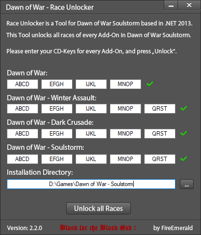

#  Soulstorm - Race Unlocker
#### Blood for the Blood God !

## Introduction

Soulstorm-RaceUnlocker is a *Tool* for Dawn of War - Soulstorm based in VB.NET 2013.

This Tool unlocks all races of every Add-On in Dawn of War - Soulstorm without installing them.
So you just need Soulstorm installed but you need a valid serial number for each other expansion!

## Preview image

## Requirements

+ Platform: Windows (32/64bit)
+ Supported: 2000, XP, 2003, Vista, 7, 8 and 10.
+ .NET Framework ≥ 4.0
+ MS Visual Studio Express ≥ 2012 (only for development)

## Install

Just run the [Soulstorm - Race Unlocker.exe](https://github.com/FireEmerald/Soulstorm-RaceUnlocker/raw/master/pre-compiled/Soulstorm%20-%20Race%20Unlocker.exe). No installation required.

## How to use

- Start the [Soulstorm - Race Unlocker.exe](https://github.com/FireEmerald/Soulstorm-RaceUnlocker/raw/master/pre-compiled/Soulstorm%20-%20Race%20Unlocker.exe)
- Insert your serial numbers of each expansion and for Soulstorm
- Select the installation location of Soulstorm
- Click *Unlock*, done!

Now you should be able to play Dawn of War - Soulstorm and select each race without installed expansions.
If you get an error, you should take a look at the "Race Unlocker Log.log" at your desktop.

The log contains all informations about what's going on while *installing*.

## Reporting issues

Use the Github Issuetracker to report a bug. Make sure to include the *.log file.

## Submitting fixes

Fixes are submitted as pull request via Github or as code in a issue.

## Copyright

Copyright (C) 2013-2018 by [FireEmerald](https://github.com/FireEmerald)

Copyright (C) 2008-2009 by n0|Belial2003, from dow.4players.de Forum (offline now)

License: [GPL 3.0](LICENSE)
